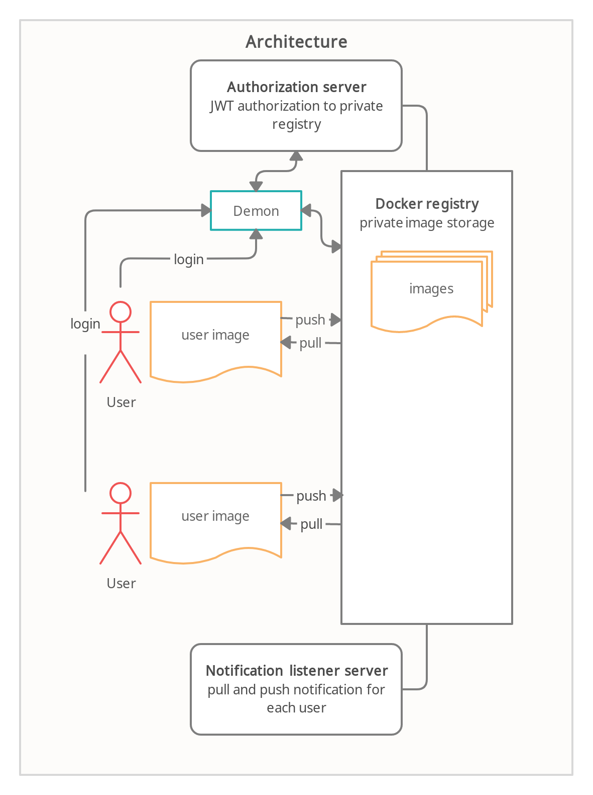

**Архитектура**

**Команды для разворачивания STS_docker_auth в контейнере**

**1. Создать HOSTNAME**

    `export HOSTNAME=$(hostname)`

**2. Сертификаты.**

Для работы docker registry и cервис авторизации необходимо [настроить сертификаты](https://docs.docker.com/registry/insecure/).

- сертификаты для сервиса авторизации:

    `openssl genrsa -out certs/STS_docker_auth.key 2048`

    `openssl req -new -x509 -sha256 -key certs/STS_docker_auth.key -out certs/STS_docker_auth.crt -days 365 -subj "/O=sergbelom/OU=Auth/CN=${HOSTNAME}"`

- сертфикаты для Docker Registry:

    `openssl genrsa -out certs/myregistry.key 2048`

    `openssl req -new -x509 -sha256 -key certs/myregistry.key -out certs/myregistry.crt -days 365 -subj "/O=sergbelom/OU=Registry/CN=${HOSTNAME}"`

- скопировать сертификаты из `certs/*.crt` в `/usr/local/share/ca-certificates/`

    перейти в директорию certs:

    `sudo cp *.crt /usr/local/share/ca-certificates/`

    обновить сертификаты:

    `sudo update-ca-certificates`

- перезапустить docker сервис для обновления сертификатов

    `sudo service docker restart`

**3. Build образа. Запуск контейнера с сервисом авторизации STS_docker_auth. Запуск Docker Registry.**

STS_docker_auth на порту 5001, Docker Registry на порту 5000.

Необходимо перейти находится в корневой директории репозитория STS_docker_auth.

Make файл в директории имеет две команды build и run.

   `make build` будет собран образ *sergbelom/sts_docker_auth*

   `make run` в терминале будет запущен docker compose *docker registry* и *sts_docker_auth*

**4. Авторизация.**

- login и logout в сервис авторизации:

    docker login https://${HOSTNAME}:5000

    docker logout https://${HOSTNAME}:5000

- создание тега образа для Docker Registry:

    небольшие образы:

    - ubuntu:

    docker pull ubuntu:latest

    docker tag ubuntu:latest ${HOSTNAME}:5000/my/ubuntu:latest

    образы размера ~ 1 Gb

    - mssql-server-linux:

    docker tag microsoft/mssql-server-linux:latest ${HOSTNAME}:5000/microsoft/mssql-server-linux:latest

    docker push ${HOSTNAME}:5000/microsoft/mssql-server-linux:latest

    - ros:

    docker tag ros:latest ${HOSTNAME}:5000/my/ros:latest

    docker push ${HOSTNAME}:5000/my/ros:latest

    - python:

    docker tag python:2 ${HOSTNAME}:5000/my/python:2

    docker push ${HOSTNAME}:5000/my/python:2

- команды pull и push для Docker Registry:

    docker push ${HOSTNAME}:5000/my/ubuntu:latest

    docker pull ${HOSTNAME}:5000/my/ubuntu:latest

    docker pull --token=[jwt] ${HOSTNAME}:5000/my/ubuntu:latest

    docker pull --username=jwt --password=[token] ${HOSTNAME}:5000/my/ubuntu:latest

Если пользователь авторизован, то команды pull и push будут проходить успешно.

**5. Остановка сервиса авторизации и контейнера Docker Registry.**

    Ctrl-C в терминале с запущенным docker compose 

    `docker stop sts_docker_auth && docker rm sts_docker_auth`

    `docker stop sts_docker_auth_registry_1 && docker rm sts_docker_auth_registry_1`

**6. Сервис авторизации внутри STS.**

разворачивание:

логин:

    docker login localhost

    docker logout localhost

